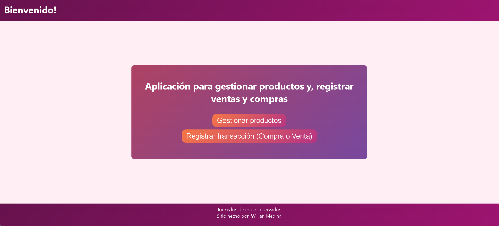

# Sistema de Gestión de Productos y Transacciones

Aplicación web para la gestión de productos y registro de transacciones (compras y ventas)

---

# Requisitos

Para ejecutar el proyecto en entorno local necesitas:

### Backend

* .NET 6 o superior
* SQL Server (LocalDB o instancia local)
* Visual Studio 2022 o VS Code
* SDK de .NET instalado

### Frontend

* Node.js (v18 o superior recomendado)
* Angular CLI
* Navegador moderno (Chrome, Edge, Firefox)

---

# Ejecución del Backend

### 1️⃣ Clonar el repositorio

```bash
git clone https://github.com/hashidk/evaluacion_fullstack.git
cd eval_back
```

### 2️⃣ Configurar cadena de conexión

Editar el archivo:

```
appsettings.json
```

Modificar la cadena para que coincida con su servidor:

```json
"ConnectionStrings": {
  "DefaultConnection": "Server=localhost;Database=eval_database;Trusted_Connection=True;TrustServerCertificate=True;"
}
```

### Generar base de datos

En el repositorio encontrará el archivo:

```
setup_database.sql
```
En este archivo se encuentran todas instrucciones para generar la base de datos, las tablas con sus campos, también se agregar valores a las tablas a modo de inicio.


### Ejecutar el proyecto

Cada servicio debe ejecutarse por separado, por ende, estando en el directorio:
```bash
eval_back
```
Primero debe acceder al microservicio ProductosService 
```bash
cd ProductosService
```
y ejecutar dicho servicio:

```bash
dotnet run
```

De igual forma con el servicio TransaccionesService
```bash
cd ProductosService
dotnet run
```


Los microservicios quedarán disponible en:

```
ProductosService: http://localhost:5041/api
TransaccionesService: http://localhost:5086/api
```

---

# Ejecución del Frontend

### Ir al directorio del frontend

```bash
cd eval_front
```

### Instalar dependencias

```bash
npm install
```

### Ejecutar servidor de desarrollo

```bash
ng serve
```

La aplicación estará disponible en:

```
http://localhost:4200
```

---

# Funcionalidades Implementadas

## Gestión de Productos

* Creación de productos
* Eliminación de productos
* Edición de productos
* Listado dinámico con paginación

## Gestión de Transacciones

* Registro de ventas
* Registro de compras
* Historial por producto
* Actualización automática de stock

## Filtros Dinámicos (incompleto o nulo :c)

* Filtrado por rango de fechas
* Filtrado por tipo de transacción (Compra / Venta)
* Filtros reactivos en tiempo real

## Formularios Reactivos

* Formularios dinámicos con FormArray
* Validaciones de stock
* Manejo de errores

---

# Evidencias

A continuación se presentan capturas de pantalla que demuestran la funcionalidad del sistema:

---
## Home



## Listado dinámico con paginación

.png)

---

## Pantalla de creación o de edición de productos


---

## Pantalla de creación de transacciones


---


# Arquitectura

El proyecto está dividido en:

* Backend: Arquitectura en Microservicios, microservicio ProductosService y TransaccionesService con la siguiente estructura: (Router -> Controllers -> Casos de Uso -> DataContext -> Modelos)
* Frontend: Angular Standalone Components con formularios reactivos 
* Base de datos relacional con integridad referencial

---

# Consideraciones Técnicas

Base de datos:
* Producto(id_producto,nombre,categoria,imagen,precio,stock)
* Detalle(id_producto,id_transaccion,id_detalle,cantidad)
* Transaccion(id_transaccion,fecha, precio_total, tipo)
Características
* Validación de integridad mediante Foreign Keys.
* Manejo de errores HTTP.
* Paginación manual en frontend.
* Formularios dinámicos con sincronización reactiva.

---

# 👨‍💻 Autor

Desarrollado como proyecto de evaluación técnica por: Willian Medina
* Considero que existen muchas cosas por mejorar tanto en estructura en documentación como codificación, pero teniendo en cuenta el tiempo limitado, coloqué esfuerzo, cariño y pasión, y con mucho gusto perfeccionaré el proyecto con el tiempo aún a pesar de no ser seleccionado.


